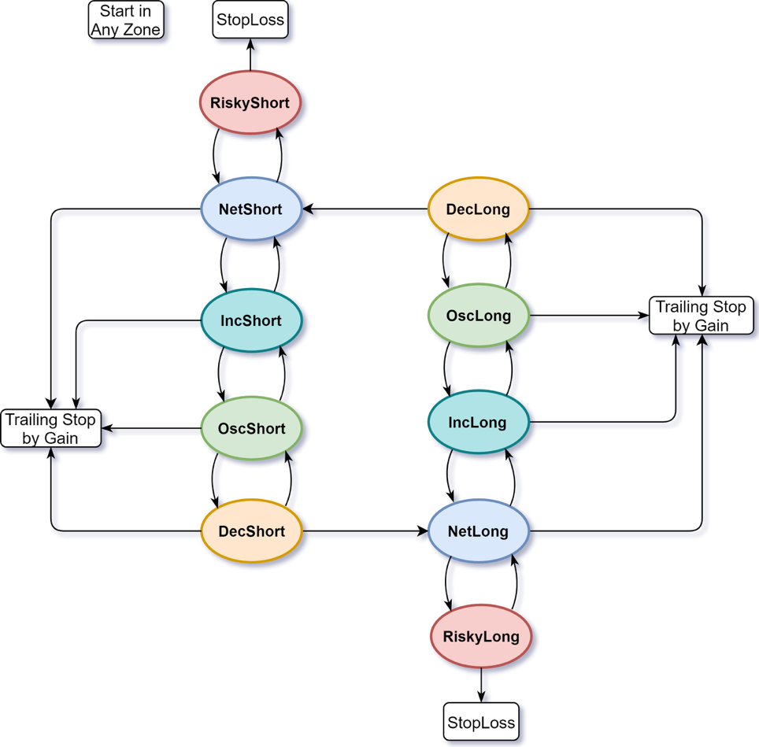
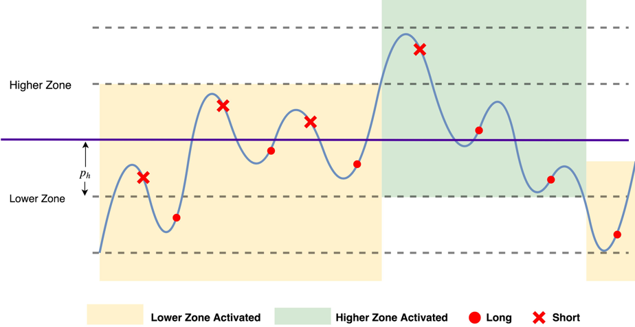

# Swing Trading

### An automatic swing trading strategy implementation.

## Features

* Automatically reverse positions while market price swings in a pre-defined range.
* Swing range is split into price zones to gradually increase or decrease holding positions to reduce risk and smooth out capital usage.
* Grid-based oscillatory trading in each price zone by trailing stop.
* Advanced adaptive order type reduces timing risk with 4 excecution modes: `PATIENT, ACCELERATED, URGENT, PANIC`.
* Automatic stop for loss cut or profit taking.

## Price Zone Definition and Transition

## Direction Reversal (Swing)

## Grid-Based Oscillatory Trading

## Zone Switch

## State Transition Implementation

